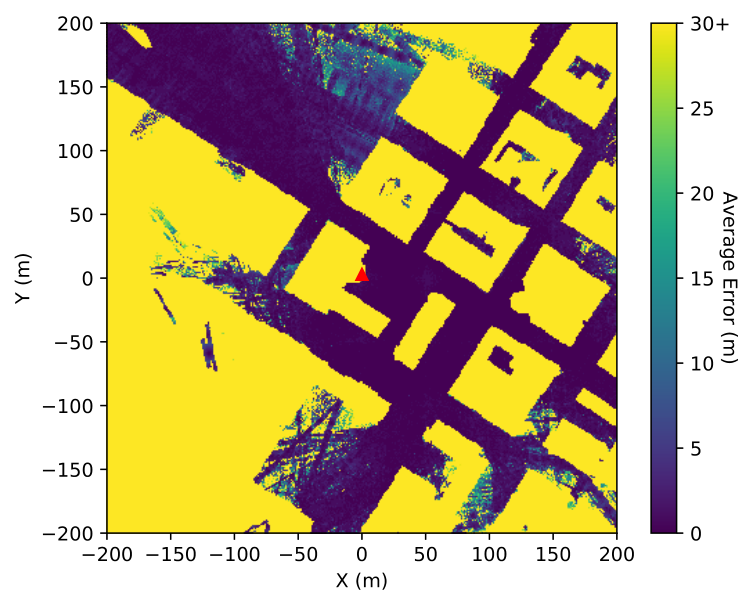
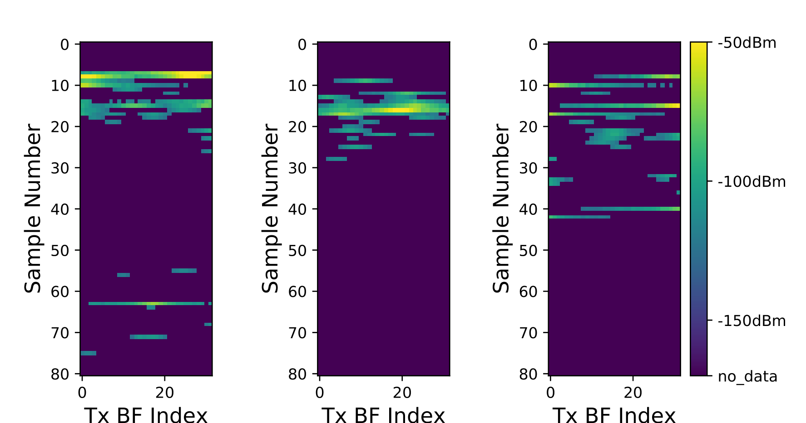

# Beamformed Fingerprint Learning

[Last major update: 16-Feb-2019 (Added LSTMs to the tracking folder. Can now toggle between TCNs and LSTMs)]

A ML based algorithm that enables accurate positioning from mmWave transmissions - with and without tracking. For
the corresponding [papers](#papers), check their section.

  

## Background

With 5G millimeter wave wireless communications, the resulting radiation reflects on most visible
objects, creating rich multipath environments. The radiation is thus significantly shaped by the obstacles
it interacts with, carrying latent information regarding the relative positions of the transmitter, the
obstacles, and the mobile receiver.

In this GitHub repository, the creation of **beamformed fingerprints** is achieved
through a pre-established codebook of beamforming patterns transmitted by a base station (see examples below).
Making use of the aforementioned hidden information, deep learning techniques are employed to
convert the received beamformed fingerprints into a mobile device’s position. The average errors of down to
**3.30/1.78 meters (non-tracking/tracking)** are obtained
on realistic outdoor scenarios, containing **mostly non-line-of-sight positions**, making it a very competitive
and promising alternative for outdoor positioning.

  

The image shown at the top contains the simulated results for the average error per covered position. Given that the transmitter
is the red triangle at the center of the image, and most of the solid yellow shapes are buildings (see the other image
below), it is possible to confirm that being in a NLOS position is not a constraint for the proposed system.

For more information, refer to papers section of this README file. If you find any mistake, please contact me (joao.gante@tecnico.ulisboa.pt).

## Getting Started

These instructions will get you a copy of the project up and running on your local machine for development and testing purposes.

This repository is split in three parts (each with their own internal README):
- data_preprocessing (converts the raw ray-tracing data into an organized table);
- non-tracking (ML algorithms for position estimates from a single beamformed fingerprint);
- tracking (ML algorithms for position estimates from a sequence of beamformed fingerprints).

*The data pre-processing sequence only needs to be executed if a different sampling rates are desired. The "final_table" file, available in the link to the used data, contains the output of the pre-processing for 20MHz.*

### Data

The data is available [here](https://drive.google.com/drive/folders/1gfbZKCsq4D1tvPzPHLftWljsVaL2pjg_?usp=sharing). If the link is broken or something is not working properly, please contact me through email (joao.gante@tecnico.ulisboa.pt).

The data was generated using the [Wireless InSite ray-tracing simulator](https://www.remcom.com/wireless-insite-em-propagation-software/) and a [high precision open-source 3D map of New York](http://www1.nyc.gov/site/doitt/initiatives/3d-building.page), made available by the New York City Department of Information Technology & Telecommunications.
The simulation consists of a 400 by 400 meters area, centered at the [Kaufman Management Center](https://goo.gl/maps/xrqvT9VS59K2).

  

### Key Prerequisites

- C++ compiler *(if different sampling rates are desired)*
- Python 3.x
- Tensorflow *(used version: 1.10)*

## Authors

* **João Gante**

## Papers

"Beamformed Fingerprint Learning for Accurate Millimeter Wave Positioning" --- VTC Fall 2018 [ieeexplore_link](https://ieeexplore.ieee.org/document/8690987) (also here: [arxiv_link](https://arxiv.org/abs/1804.04112))

"Enhancing Beamformed Fingerprint Outdoor Positioning with Hierarchical Convolutional Neural Networks" --- ICASSP 2019 [ieeexplore_link](https://ieeexplore.ieee.org/document/8683782)

Tracking-related paper - coming soon :)

## License

This project is licensed under the MIT License - see the [LICENSE.md](LICENSE.md) file for details

## Acknowledgments

* **Leonel Sousa** and **Gabriel Falcão**, my PhD supervisors;
* **IST** and **INESC-ID**, who hosted my PhD.
