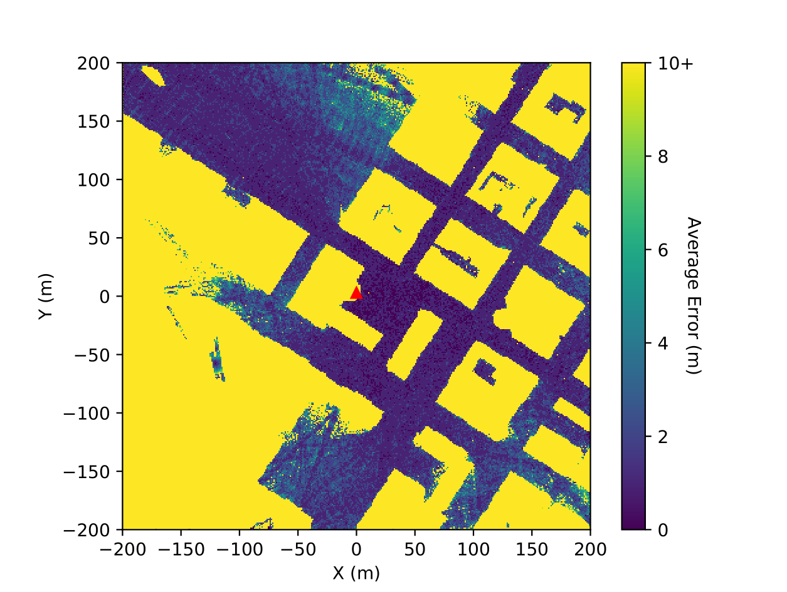

# Beamformed Fingerprint Learning

[Last major update: 10-Sep-2019 (Code updated and converted into Python package)]

A ML based algorithm that enables accurate positioning from mmWave transmissions - with and without tracking.

<p align="center">
  
</p>

### Table of Contents
1. [Background](#background)
2. [Papers](#papers)
    - [Citation](#citation)
    - [List of Papers](#list-of-papers)
3. [Getting Started](#getting-started)
    - [Before Installing](#before-installing)
    - [Installation](#installation)
    - [Data Downloading](#data-downloading)
4. [Experiments](#experiments)
   - [Configuration](#configuration)
   - [Running an Experiment](#running-an-experiment)
5. [License](#licence)
6. [Acknowledgments](#acknowledgments)


## Background

With **5G millimeter wave wireless communications**, the resulting radiation reflects on most visible
objects, creating rich multipath environments. The radiation is thus significantly shaped by the obstacles
it interacts with, carrying latent information regarding the relative positions of the transmitter, the
obstacles, and the mobile receiver, as depicted in the simulation below.


<p align="center">
  
</p>


In this GitHub repository, the creation of **beamformed fingerprints** is achieved
through a pre-established codebook of beamforming patterns transmitted by a **single base station** (see examples below).
Making use of the aforementioned hidden information, deep learning techniques are employed to
convert the received beamformed fingerprints into a mobile device’s position. The average errors of down to
**3.30/1.78 meters (non-tracking/tracking)** are obtained
on realistic outdoor scenarios, containing **mostly non-line-of-sight positions**, making it a very competitive
and promising alternative for **outdoor positioning**.


<p align="center">
  
</p>

The image shown at the top contains the simulated results for the average error per covered position. Given that the transmitter
is the red triangle at the center of the image, and most of the solid yellow shapes are buildings, it is possible to
confirm that **being in a NLOS position is not a constraint for the proposed system**. It is able to provide an estimative for
every position that has mmWave signal.


For more information, refer to [papers](#papers) section of this README file. If you find any issue, please contact me
(joao.gante@tecnico.ulisboa.pt).


## Papers

### Citation

The main citation for this work is the following:

```
@Article{Gante2019,
    author="Gante, Jo{\~a}o and Falc{\~a}o, Gabriel and Sousa, Leonel",
    title="{Deep Learning Architectures for Accurate Millimeter Wave Positioning in 5G}",
    journal="Neural Processing Letters",
    year="2019",
    month="Aug",
    day="13",
    issn="1573-773X",
    doi="10.1007/s11063-019-10073-1",
    url="https://doi.org/10.1007/s11063-019-10073-1"
}
```

### List of Papers

(From newest to oldest)

"Deep Learning Architectures for Accurate Millimeter Wave Positioning in 5G" --- Neural Processing Letters ([link](https://rdcu.be/bOOpk) -- a post-peer-review, pre-copyedit version is also available [here](https://drive.google.com/open?id=19P7Ebg80pVqyHNkfPDQNweozl4k4S6RC))

"Enhancing Beamformed Fingerprint Outdoor Positioning with Hierarchical Convolutional Neural Networks" --- ICASSP 2019 ([ieeexplore](https://ieeexplore.ieee.org/document/8683782))

"Beamformed Fingerprint Learning for Accurate Millimeter Wave Positioning" --- VTC Fall 2018 ([ieeexplore](https://ieeexplore.ieee.org/document/8690987) , also on [arxiv](https://arxiv.org/abs/1804.04112))


## Getting Started

These instructions will get you a copy of the project up and running on your local machine for development and testing purposes.

### Before Installing

To ensure a smooth process, please ensure you have the following requirements.

**Hardware**
- Nvidia GPU with Compute Capability 3.5 or higher
- at least 16GB of RAM

**Software**
- Python 3.x
- CUDA 10.0 (for TensorFlow)

### Installation

Clone this repository, and then install it and its requirements. It should be something similar to this:

```
git clone https://github.com/gante/mmWave-localization-learning.git
pip3 install -e mmWave-localization-learning/
pip3 install -r mmWave-localization-learning/requirements.txt
```

### Data Downloading

The data is available [here](https://drive.google.com/drive/folders/1gfbZKCsq4D1tvPzPHLftWljsVaL2pjg_?usp=sharing). If the link is broken or something is not working properly, please contact me through email (joao.gante@tecnico.ulisboa.pt).

The data was generated using the [Wireless InSite ray-tracing simulator](https://www.remcom.com/wireless-insite-em-propagation-software/) and a [high precision open-source 3D map of New York](http://www1.nyc.gov/site/doitt/initiatives/3d-building.page), made available by the New York City Department of Information Technology & Telecommunications.
The simulation consists of a 400 by 400 meters area, centered at the [Kaufman Management Center](https://goo.gl/maps/xrqvT9VS59K2).


## Experiments

### Configuration

All experiments steps are controled by the *configuration file*, a `.yaml` file with all the options for the desired experiment.
I recommend the creation of a new configuration file for each experiment, and a few examples are available [here](examples/). These examples can reproduce the results of [this](#citation) paper, and the available options are either self-explainatory,
or have plenty of comments in the file.

### Running an Experiment

Assuming you have set a configuration file in `/path/to/config.yaml`, and the configuration file's `input_file` option contains the path to the downloaded `final_table`, these are the steps to fully run an experiment:

```
python3 bin/preprocess_dataset.py /path/to/config.yaml
python3 bin/train_model.py /path/to/config.yaml
python3 bin/test_model.py /path/to/config.yaml
```

The last step ends with the key metrics being printed to your terminal. If you want to visualize additional results, you can use the visualization tools provided [here](/visualization). E.g.:

```
python3 visualization/plot_histogram.py /path/to/config.yaml
```

*Note - If different sampling frequencies are desired, the original, text-based data (`CIR32_zip`) must be parsed again.*
*Unfortunatelly, the archaic tool I built for that is written in C, and requires extra steps (see instructions [here](/parsing)).*
*The `final_table` file, available in the link to the used data, contains the output of that parsing for a sampling frequency of 20MHz.*
*Let me know if you require aid here.*

## License

This project is licensed under the MIT License - see the [LICENSE.md](LICENSE.md) file for details

## Acknowledgments

* **Leonel Sousa** and **Gabriel Falcão**, my PhD supervisors;
* **IST** and **INESC-ID**, who hosted my PhD;
* **FCT**, who funded my PhD.
