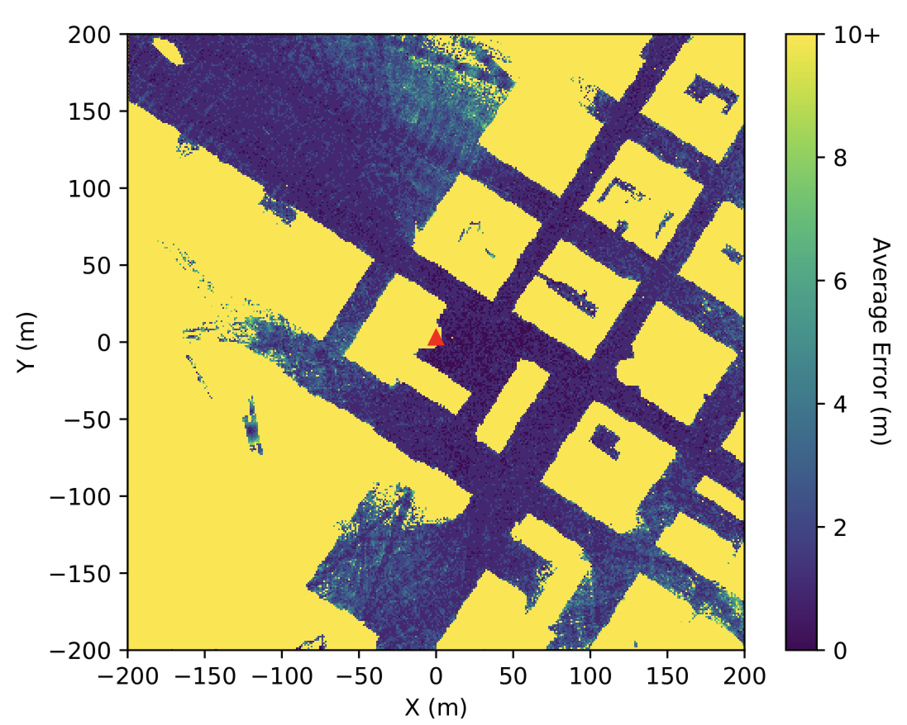
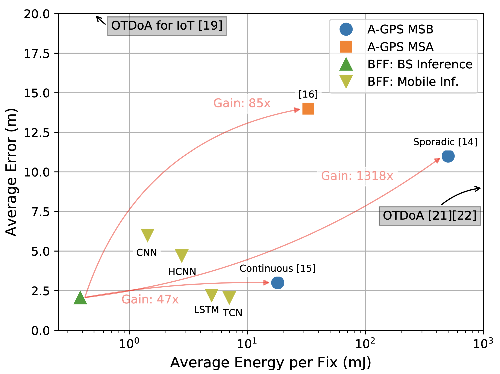
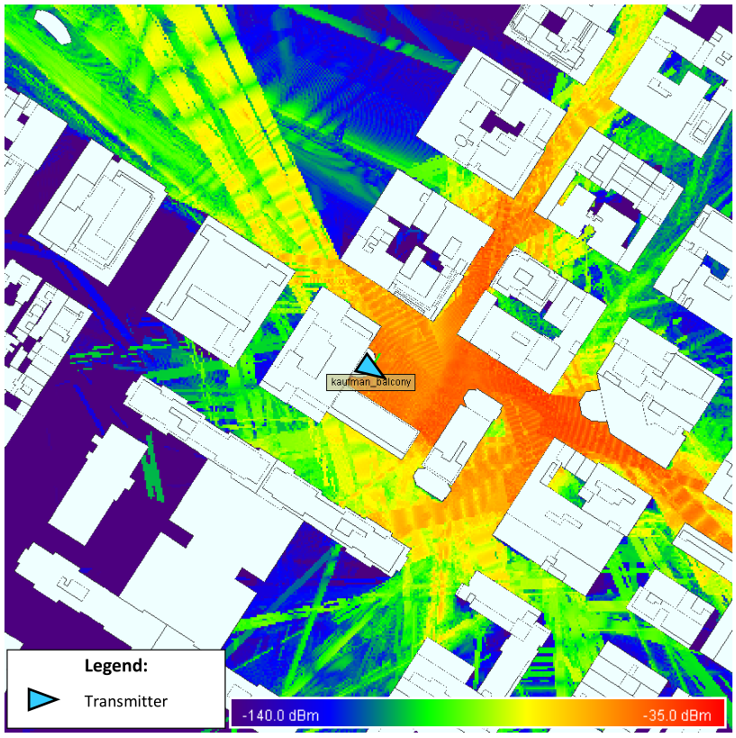
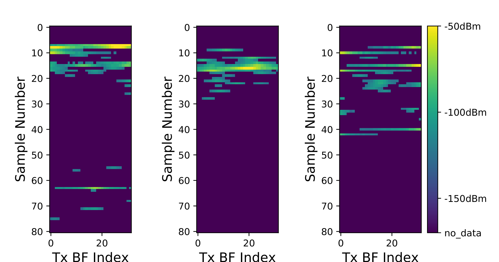
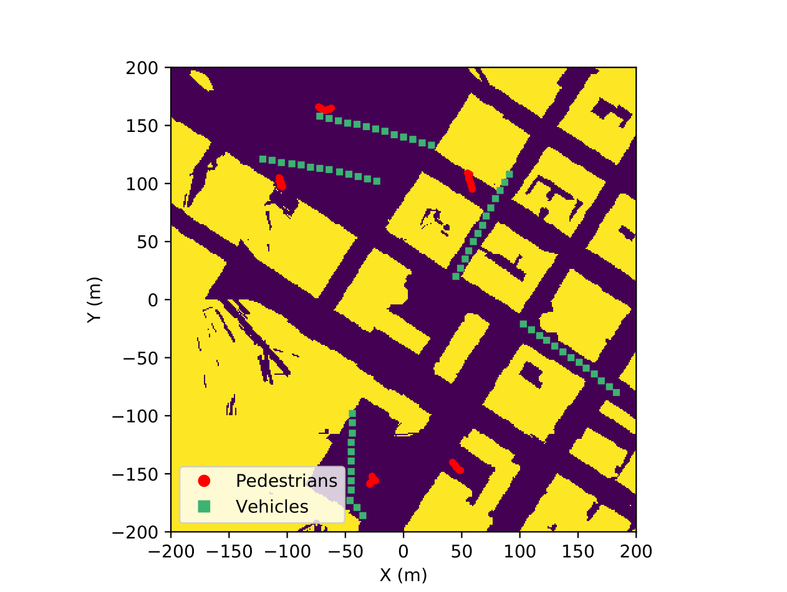
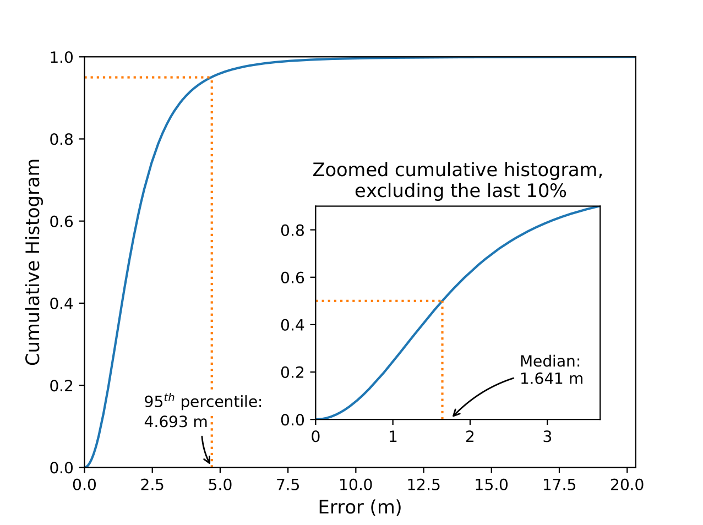
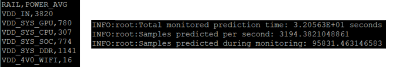

# Beamformed Fingerprint Learning

An ML-based algorithm that enables energy efficient accurate positioning from mmWave transmissions, with and without tracking.

<p align="center">
  
  
</p>


### Table of Contents
1. [Background](#background)
2. [Papers](#papers)
    - [Citation](#citation)
    - [List of Papers](#list-of-papers)
3. [Getting Started](#getting-started)
    - [Before Installing](#before-installing)
    - [Installation](#installation)
    - [Dataset](#dataset)
4. [Experiments](#experiments)
   - [Configuration](#configuration)
   - [Tracking](#tracking)
   - [Running an Experiment](#running-an-experiment)
   - [Evaluate performance on an Nvidia Jetson](#evaluate-performance-on-an-nvidia-jetson)
5. [License](#license)
6. [Acknowledgments](#acknowledgments)


## Background

With **5G millimeter wave wireless communications**, the resulting radiation reflects on most visible objects, creating rich multipath environments, as depicted in the simulation below. The radiation is thus significantly shaped by the obstacles it interacts with, carrying latent information regarding the relative positions of the transmitter, the obstacles, and the mobile receiver.


<p align="center">
  
</p>


In this work, the creation of **beamformed fingerprints** is achieved through a pre-established codebook of beamforming patterns transmitted by a **single base station**. Making use of the aforementioned hidden information, deep learning techniques are employed to convert the received beamformed fingerprints (see examples below) into a mobile device’s position. Average errors of down to **3.30/1.78 meters (non-tracking/tracking)** are obtained on realistic outdoor scenarios, containing **mostly non-line-of-sight positions**.

Moreover, it was shown that this system is **47x** and **85x** more energy efficient than conventional A-GPS low-power implementations (for continuous and sporadic position fixes, respectively), making it a very competitive and promising alternative for **outdoor positioning**.


<p align="center">
  
</p>

The image shown at the top (left) contains the simulated results for the average error per covered position. Given that the transmitter is the red triangle at the center of the image, and most of the solid yellow shapes are buildings, it is possible to confirm that **being in a NLOS position is not a constraint for the proposed system**. It is able to provide an estimative for every position that has mmWave signal.

This repository also contains tools to evaluate the model performance on a low-power embedded system (Nvidia Jetson TX2), which demonstrates the low energy requirements of this solution - \< 10 mJ per position estimate, if the position inference is done at the mobile device. The comparison results are also observable at the top (right).

For more information, refer to [papers](#papers) section of this README file. If you find any issue, please contact me (joao.gante@tecnico.ulisboa.pt).


## Papers
### Citation

There are two main citations for this work.

By default, consider using the following:

```
@Article{Gante2019,
  author="Gante, Jo{\~a}o and Falc{\~a}o, Gabriel and Sousa, Leonel",
  title="{Deep Learning Architectures for Accurate Millimeter Wave Positioning in 5G}",
  journal="Neural Processing Letters",
  year="2019",
  month="Aug",
  day="13",
  issn="1573-773X",
  doi="10.1007/s11063-019-10073-1",
  url="https://doi.org/10.1007/s11063-019-10073-1"
}
```

If you are concerned about the energy efficiency of positioning methods or ML-enabled mobile applications, please use:

```
@ARTICLE{Gante2020,
  author={J. {Gante} and L. {Sousa} and G. {Falcao}},
  journal={IEEE Journal on Emerging and Selected Topics in Circuits and Systems},
  title={Dethroning GPS: Low-Power Accurate 5G Positioning Systems Using Machine Learning},
  year={2020},
  volume={10},
  number={2},
  pages={240-252},
}
```


### List of Papers

(From newest to oldest)

- "Dethroning GPS: Low-Power Accurate 5G Positioning Systems using Machine Learning" --- IEEE JETCAS ([ieeexplore](https://ieeexplore.ieee.org/document/9080126) -- a copy is also available [here](https://drive.google.com/open?id=1fUZQeUSIYGUNn7S7aXLiNUhF0OOc04_M))

- "Deep Learning Architectures for Accurate Millimeter Wave Positioning in 5G" --- Neural Processing Letters ([link](https://rdcu.be/bOOpk) -- a post-peer-review, pre-copyedit version is also available [here](https://drive.google.com/open?id=19P7Ebg80pVqyHNkfPDQNweozl4k4S6RC))

- "Enhancing Beamformed Fingerprint Outdoor Positioning with Hierarchical Convolutional Neural Networks" --- ICASSP 2019 ([ieeexplore](https://ieeexplore.ieee.org/document/8683782))

- "Beamformed Fingerprint Learning for Accurate Millimeter Wave Positioning" --- VTC Fall 2018 ([ieeexplore](https://ieeexplore.ieee.org/document/8690987) , also on [arxiv](https://arxiv.org/abs/1804.04112))


## Getting Started

These instructions will get you a copy of the project up and running on your local machine for development and testing purposes.


### Before Installing

To ensure a smooth process, please ensure you have the following requirements.

**Hardware**
- Nvidia GPU with Compute Capability 3.5 or higher
- at least 16GB of RAM (32GB recommended)

**Software**
- Python 3.6 or higher
- Tensorflow 2.4
- CUDA 11.0

### Installation

Clone this repository, and then install it and its requirements. It should be something similar to this:

```
git clone https://github.com/gante/mmWave-localization-learning.git
pip3 install -e mmWave-localization-learning/
pip3 install -r mmWave-localization-learning/requirements.txt
```

### Dataset

The dataset is available [here](https://drive.google.com/drive/folders/1gfbZKCsq4D1tvPzPHLftWljsVaL2pjg_?usp=sharing). If the link is broken or something is not working properly, please contact me through email (joao.gante@tecnico.ulisboa.pt).

The data was generated using the [Wireless InSite ray-tracing simulator](https://www.remcom.com/wireless-insite-em-propagation-software/) and a [high precision open-source 3D map of New York](http://www1.nyc.gov/site/doitt/initiatives/3d-building.page), made available by the New York City Department of Information Technology & Telecommunications.
The simulation consists of a 400 by 400 meters area, centered at the [Kaufman Management Center](https://goo.gl/maps/xrqvT9VS59K2). If you would like to have the 3D files for this or other sections of NYC, feel free to email me.


## Experiments

### Configuration

All experiments steps are controled by the *configuration file*, a `.yaml` file with all the options for the desired experiment.
I recommend the creation of a new configuration file for each experiment, and a few examples are available [here](examples/).
These examples can reproduce the results of [this](#citation) paper, and the available options are either self-explainatory,
or have plenty of comments in the file.


### Tracking

The use of a tracking or a non-tracking dataset is entirely defined by the model architecture, defined in the `model_type` option in the configuration file (`lstm` and `tcn` are the tracking options). A non-tracking dataset will be built from noisy instances of each position's data. On the other hand, the tracking dataset is first built by generating synthetic paths (as seen below), and then drawing noisy instances of the dataset for each position in a path.

<p align="center">
  
</p>


### Running an Experiment

Assuming you have set a configuration file in `/path/to/config.yaml`, and the configuration file's `input_file` option contains the path to the downloaded `final_table`, these are the steps to fully run an experiment:

```
python3 bin/preprocess_dataset.py /path/to/config.yaml
python3 bin/train_model.py /path/to/config.yaml
python3 bin/test_model.py /path/to/config.yaml
```

The last step ends with the key metrics being printed to your terminal. If you want to visualize additional results, you can use the visualization tools provided [here](/bff_positioning/visualization). E.g.:

```
python3 bff_positioning/visualization/plot_histogram.py /path/to/config.yaml
```

For the settings defined in `examples/tcn_experiment.yaml`, the aforementioned set of commands should yield the following plot.

<p align="center">
  
</p>

*Note - If different sampling frequencies are desired, the original, text-based data (`CIR32_zip`) must be parsed again.*
*Unfortunatelly, the archaic tool I built for that is written in C, and requires extra steps (see instructions [here](/extra/parsing)).*
*The `final_table` file, available in the link to the used data, contains the output of that parsing for a sampling frequency of 20MHz.*


### Evaluate performance on an Nvidia Jetson

If you wish to evaluate the performance (power consumption and throughput) of a model on an embedded system,
this sub-section is for you. The tools in this sub-section were designed for this repository, but can easily be
modified to work with any TF model on an Nvidia Jetson TX2 device.

Assuming you have copied your experiment configuration file to `/path/to/config.yaml`, and that the corresponding
trained model is in the folder pointed by the aforementioned file, you can evaluate the model performance by running:

```
sudo python3 extra/jetson/jetson_performance.py /path/to/config.yaml
```

<p align="center">
  
</p>

The script will print throughput-related information to the screen (right part of the image), and the power-related data
will be stored to `$HOME/monitor_results.txt` (left part of the image, where the values depict power in mW).
It is important that you run this script with `sudo`, as it might not be able to use the device GPU otherwise.
The image above contains results for the model in `examples/cnn_experiment.yaml`, which has an average energy
consumption of 1.196 mJ per position estimate.

NOTE: The above was working as of commit [6220366](https://github.com/gante/mmWave-localization-learning/commit/6220366084fba85a0bc3dc8b0aff26ce875c0713), using CUDA 10 and TF 1.14.
Meanwhile, I've lost access the machine, and can no longer confirm that the above works with the current code base.


## License

This project is licensed under the MIT License - see the [LICENSE.md](LICENSE.md) file for details


## Acknowledgments

* **Leonel Sousa** and **Gabriel Falcão**, my PhD supervisors;
* **IST** and **INESC-ID**, who hosted my PhD;
* **FCT**, who funded my PhD.
