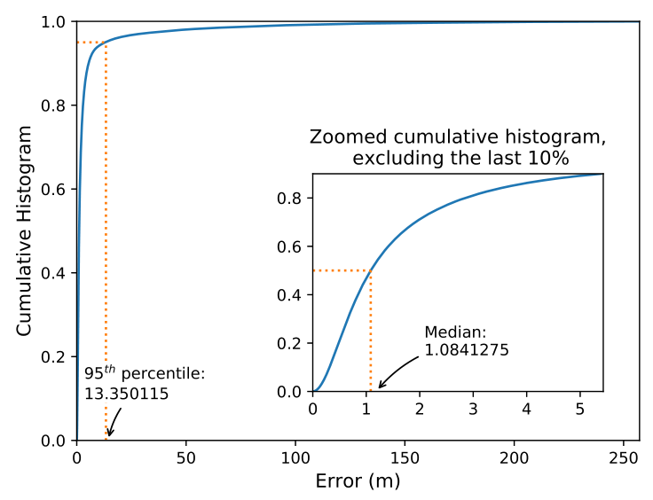

# Single Beamformed Fingerprint Estimates

This folder contains the files related to single beamformed fingerprint estimates. To train the system, follow the steps below

## Running Sequence

- [If the preprocessing wasn't run] Download the 'final_table' file into the '~\mmWave-localization-learning\data_preprocessing\data_processed' folder;
- Edit 'simulation_parameters.py' to the desired settings;
- Run the .py/.sh files whose names start with integers (1, 2, 3, and 4) sequentially.

For Windows users, a .bat is provided (to be used in place of the .sh)

## Expected results

If you execute sample_plots/PLOT_histogram.py after running the aforementioned sequence,
you should obtain the roughly following results:

  

