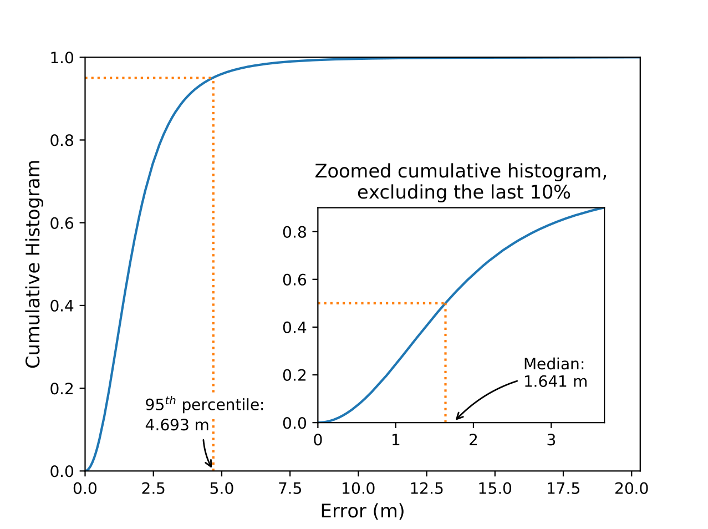
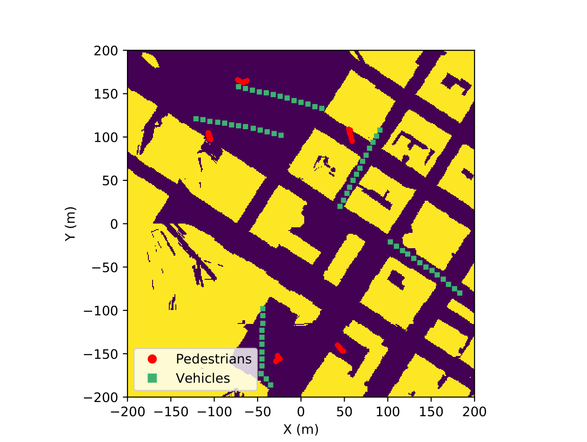

# Tracking - Estimates from Sequences of Beamformed Fingerprints

This folder contains the files related to tracking (estimates from sequences of beamformed fingerprints).
Both LSTMs and [TCNs](https://arxiv.org/abs/1803.01271) are available, with the later achieving better results.
To train the system, follow the steps below

## Running Sequence

- [If the preprocessing wasn't run] Download the 'final_table' file into the '~\mmWave-localization-learning\data_preprocessing\data_processed' folder;
- Edit 'simulation_parameters.py' to the desired settings;
- Run the .py files whose names start with integers (1, 2, 3, 4) sequentially;
- Try some of the provided plots for visualization of the results.

## Expected results

If you execute plots/PLOT_histogram.py after running the aforementioned sequence,
you should obtain the roughly following results:

  

The code to control the paths is completely editable. As it stands, it generates two types of paths, as seen below.

  

